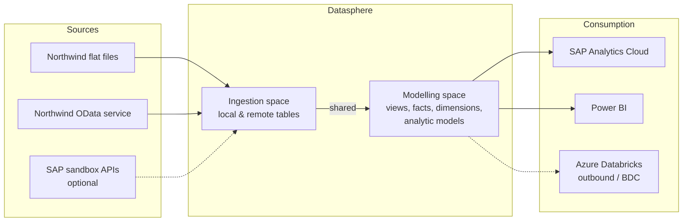

# Architecture

Living view of the solution; updated as each unit adds objects.

## Target (provisional)

```mermaid
flowchart LR
    subgraph Sources
        F[Northwind flat files]
        O[Northwind OData service]
        S[SAP sandbox APIs<br/>optional]
    end
    subgraph Datasphere
        I[Ingestion space<br/>local & remote tables]
        M[Modelling space<br/>views, facts, dimensions,<br/>analytic models]
    end
    subgraph Consumption
        SAC[SAP Analytics Cloud]
        PBI[Power BI]
        DBX[Azure Databricks<br/>outbound / BDC]
    end
    F --> I
    O --> I
    S -.-> I
    I -->|shared| M
    M --> SAC
    M --> PBI
    M -.-> DBX
```

## Current state

Nothing built yet.
